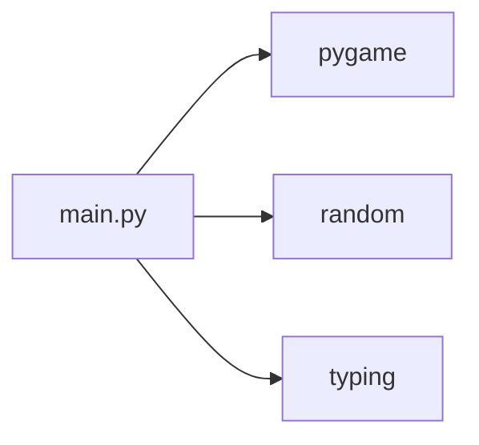
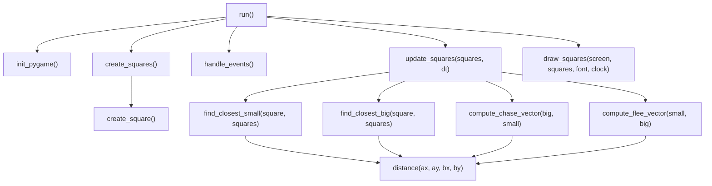
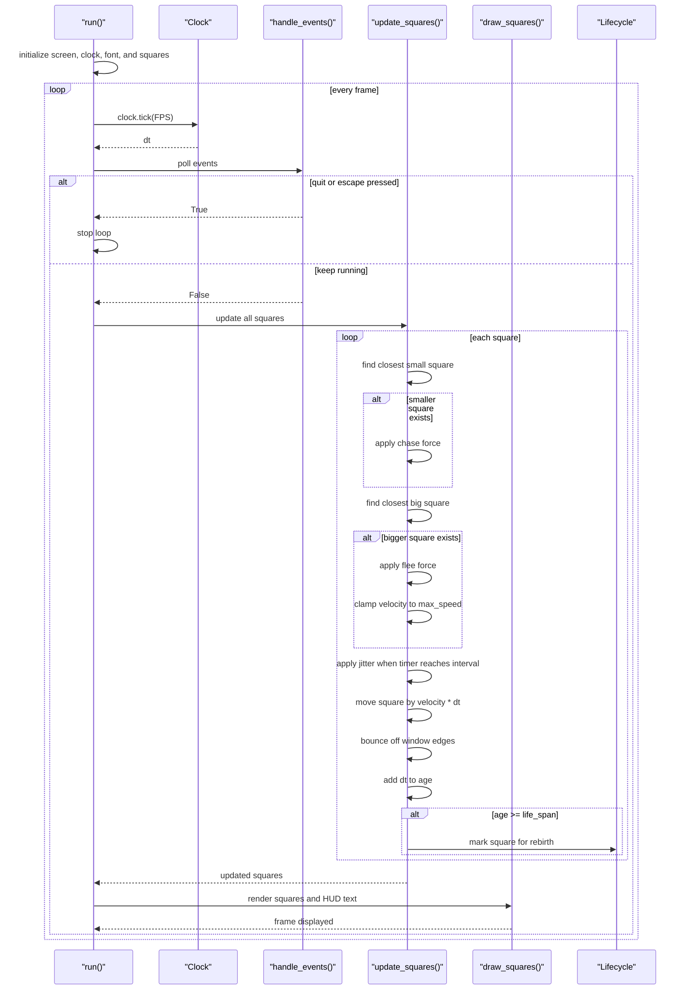

# Architecture

This project is a single-module Pygame simulation. The entire runtime lives in [main.py](../main.py), and the behavior is organized around a small set of helper functions plus one main game loop.

## Module Dependency Graph



`main.py` depends on `pygame` for windowing, timing, drawing, and event handling; `random` for square initialization and jitter; and `typing` for function signatures.

## Runtime Flow

```mermaid
flowchart TD
    A["Program start"] --> B["run()"]
    B --> C["init_pygame()"]
    C --> D["create_squares()"]
    D --> E["Main loop"]
    E --> F["clock.tick(FPS)"]
    F --> G["handle_events()"]
    G --> H{ "Quit requested?" }
    H -- "Yes" --> I["pygame.quit()"]
    H -- "No" --> J["update_squares(squares, dt)"]
    J --> K["draw_squares(screen, squares, font, clock)"]
    K --> E
```

The loop is frame driven. Each iteration gets `dt`, processes events, updates the square list, renders the scene, and repeats until quit.

## Function-Level Call Graph



`run()` orchestrates the whole application. `update_squares()` is the core physics and lifecycle function. `draw_squares()` is the rendering and HUD function.

## Primary Sequence



This sequence mirrors the real control flow in [main.py](../main.py): event handling happens before simulation, the simulation mutates square state in place, and rendering happens after updates.

## Data Flow Notes

`squares` is the main mutable data structure. It is created once in `create_squares()`, updated in place by `update_squares()`, and read by `draw_squares()`.

`dt` comes from `clock.tick(FPS) / 1000.0` and scales velocity changes, jitter timing, movement, and age progression.

Square rebirth uses reverse-index removal so the list is not corrupted while iterating.

## Key Functions

`init_pygame()` sets up the window, clock, and font.

`create_square()` builds one square with random size, speed, position, color, and lifespan.

`create_squares()` creates the initial population.

`handle_events()` exits on `QUIT` or `ESC`.

`find_closest_small()` and `find_closest_big()` scan the list to locate the nearest smaller or larger square.

`compute_chase_vector()` and `compute_flee_vector()` turn relative positions into normalized steering vectors.

`update_squares()` applies steering, jitter, movement, bouncing, aging, and rebirth.

`draw_squares()` renders the squares and overlays FPS, particle count, and average X.

`run()` owns the application loop.

## Assumptions

The documentation reflects the current `main.py` only. There are no additional Python modules in the repository, so the architecture is intentionally flat and single-file.