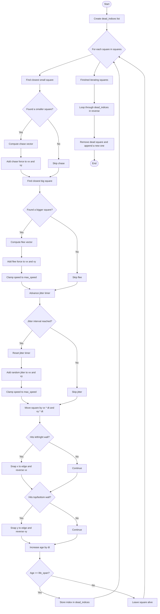

# `update_squares()` Flowchart

This diagram shows the execution order inside `update_squares(squares, dt)`.

## Order Summary

1. Chase behavior runs first.
2. Flee behavior runs second.
3. Jitter is applied third, only on its timer.
4. Position update happens after all velocity changes.
5. Wall bounce happens after movement.
6. Age/life-span checks happen last.
7. Dead squares are replaced after the main loop finishes.